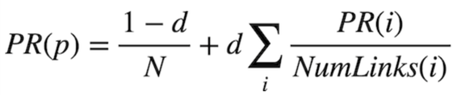

## Iterative Algorithm

### Define a PageRank using a recursive mathematical expression

- With probability 1 - d, the surfer chose a page at random and ended up on page p.
- With probability d, the surfer followed a link from a page i to page p.

- `i` ranges over all pages that link to page `p`
- `N` total number of pages in subspace
- `NumLinks(i)` is the number of links present on page `i`.
- `d` damping factor.

In the first part of formula we calculate probability that the page can be randomly selected by a surfer considering the damping factor `d`. 
For the second part, we need to consider each possible page `i` that links to page `p`. For each of those incoming pages, let `NumLinks(i)` be the number of links on page `i`. Each page `i` that links to `p` has its own PageRank, `PR(i)`, representing the probability that we are on page `i` at any given time. And since from page `i` we travel to any of that page’s links with equal probability, we divide `PR(i)` by the number of links `NumLinks(i)` to get the probability that we were on page `i` and chose the link to page `p`.

