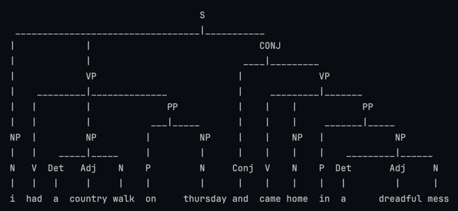
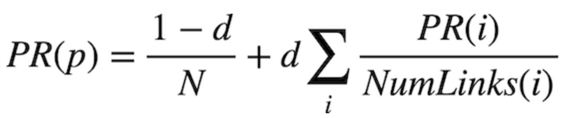

# CS50AI Projects

1. [Minesweeper Game: Propositional Logic](#minesweeper-game-propositional-logic)
2. [Nim Game AI: Reinforcement Learning using Q-Learning](#nim-game-ai-reinforcement-learning-using-q-learning)
3. [Traffic: Deep Learning](#traffic-deep-learning)
4. [Parser: NLP](#parser)
5. [Crossword: AC3 Optimization](#crossword-ac3-optimization)
6. [Heredity: Bayesian Network Model](#heredity-bayesian-network-model)
7. [PageRank: Probability](#pagerank)
8. and more

## Minesweeper Game: Propositional Logic
[1. Knowledge Minesweeper Specification](https://cs50.harvard.edu/ai/2024/projects/1/minesweeper/)

### Description:
Minesweeper game implemented with `pygame`, offering both solo play AI play. The Minesweeper game follows the classic rules where the player must uncover all cells on the board.

### Implementation
The game implementation utilizes **Propositional Logic** for intelligent decision-making based on the current state of the board. Information like uncovered tiles and nearby mines is stored in the AI's state, enabling it to reason logically and deduce safe moves or identify mines with each new piece of information.

## Nim Game AI: Reinforcement Learning using Q-Learning

### Description:
This project implements an AI to play the game of *Nim* using *Reinforcement Learning* through the *Q-learning* algorithm. The AI learns by playing games against itself, improving its strategy over time to make better decisions in future games.

[Nin Game requirements](https://cs50.harvard.edu/ai/2024/projects/4/nim/)

`Q(s,a)←Q(s,a)+α×(new_estimate−old_estimate)`

- `α (alpha)` is the learning rate, controlling how much value new information.
- `new estimate` is the sum of the immediate reward and the future rewards from the next state.
- `old estimate` is the current Q-value for the state-action pair.

## Traffic: Deep learning
This project uses deep learning and convolutional neural networks (CNNs) to classify road sign images. 

In this project I am using TensorFlow to build a neural network for classifying road signs from images. 

And the German Traffic Sign Recognition Benchmark (GTSRB) dataset, which contains thousands of labeled images of 43 different types of road signs.

## Parser

[Project 6. Language | Parser](https://cs50.harvard.edu/ai/2024/projects/6/parser/#parser)

The parser task in AI and natural language processing (NLP) involves generating a syntactic structure, or parse tree, for a given sentence based on defined grammar rules. 

This task uses NLTK to implement a context-free grammar (CFG) and a chart parser, allowing for an analysis of sentence structures. The parser identifies noun phrase chunks by breaking down sentences into their grammatical components.

## Crossword: AC3 Optimization
[3. Optimization Crossword Specification](https://cs50.harvard.edu/ai/2024/projects/3/crossword/)
### Key Concepts
- AC3 Algorithm: Ensures arc consistency for all variable pairs.
- Backtracking Search: Generates crossword puzzles based on constraint satisfaction.
- Efficient Variable Ordering: Uses MRV and Degree heuristics to speed up solving.

## Heredity: Bayesian Network Model

### Description
The task in this project is to use **Bayesian Network Model** to make inferences about a population. Given information about people, who their parents are, and whether they have a particular observable trait (e.g. hearing loss) caused by a given gene, the AI will infer the probability distribution for each person’s genes, as well as the probability distribution for whether any person will exhibit the trait in question using **join probability**.

## PageRank

### Define a PageRank using a recursive mathematical expression

- With probability 1 - d, the surfer chose a page at random and ended up on page p.
- With probability d, the surfer followed a link from a page i to page p.

- `i` ranges over all pages that link to page `p`
- `N` total number of pages in subspace
- `NumLinks(i)` is the number of links present on page `i`.
- `d` damping factor.
