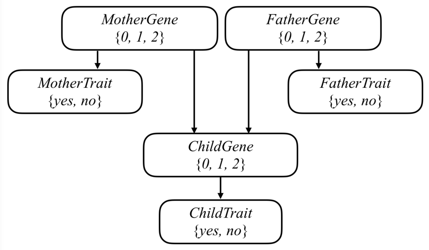

# Write an AI to assess the likelihood that a person will have a particular genetic trait.

### Model Bayesian Network

The task in this project is to use this model to make inferences about a population. Given information about people, who their parents are, and whether they have a particular observable trait (e.g. hearing loss) caused by a given gene, the AI will infer the probability distribution for each person’s genes, as well as the probability distribution for whether any person will exhibit the trait in question.

