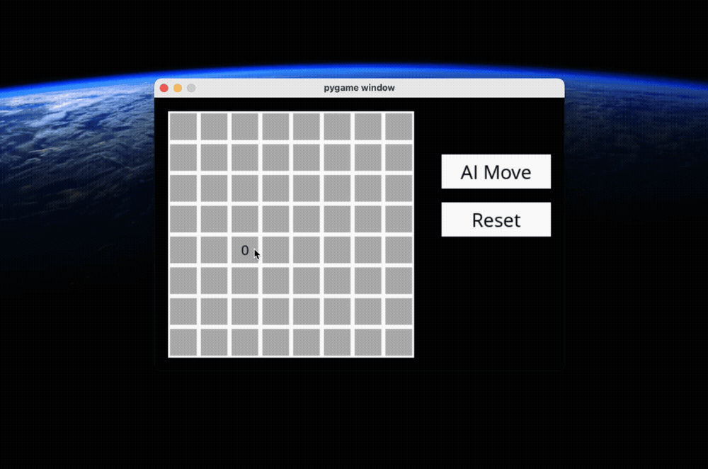

# CS50AI Projects

## Minesweeper Game

### Description:
Minesweeper game implemented with `pygame`, offering both solo play and the option for an AI player. The Minesweeper game follows the classic rules where the player must uncover all cells on the board.

## Features:

**Solo Play**: Enjoy the classic Minesweeper game experience by playing solo.
**AI Player**: Watch the AI player in action as it uses propositional logic to make decisions.

## Implementation
The game implementation utilizes **Propositional Logic** for intelligent decision-making.

